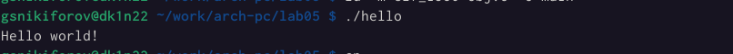

---
## Front matter
title: "Лабораторная работа No5."
subtitle: "Создание и процесс обработки программ на языке ассемблера NASM"
author: "Георгий Никифорв Сергеевич"

## Generic otions
lang: ru-RU
toc-title: "Содержание"

## Bibliography
bibliography: bib/cite.bib
csl: pandoc/csl/gost-r-7-0-5-2008-numeric.csl

## Pdf output format
toc: true # Table of contents
toc-depth: 2
lof: true # List of figures
lot: true # List of tables
fontsize: 12pt
linestretch: 1.5
papersize: a4
documentclass: scrreprt
## I18n polyglossia
polyglossia-lang:
  name: russian
  options:
	- spelling=modern
	- babelshorthands=true
polyglossia-otherlangs:
  name: english
## I18n babel
babel-lang: russian
babel-otherlangs: english
## Fonts
mainfont: PT Serif
romanfont: PT Serif
sansfont: PT Sans
monofont: PT Mono
mainfontoptions: Ligatures=TeX
romanfontoptions: Ligatures=TeX
sansfontoptions: Ligatures=TeX,Scale=MatchLowercase
monofontoptions: Scale=MatchLowercase,Scale=0.9
## Biblatex
biblatex: true
biblio-style: "gost-numeric"
biblatexoptions:
  - parentracker=true
  - backend=biber
  - hyperref=auto
  - language=auto
  - autolang=other*
  - citestyle=gost-numeric
## Pandoc-crossref LaTeX customization
figureTitle: "Рис."
tableTitle: "Таблица"
listingTitle: "Листинг"
lofTitle: "Список иллюстраций"
lotTitle: "Список таблиц"
lolTitle: "Листинги"
## Misc options
indent: true
header-includes:
  - \usepackage{indentfirst}
  - \usepackage{float} # keep figures where there are in the text
  - \floatplacement{figure}{H} # keep figures where there are in the text
---

# Цель работы

Освоение процедуры компиляции и сборки программ, написанных на ассемблере NASM

# Выполнение лабораторной работы

Создал каталог для работы с программами на языке ассемблера NASM:

Перешел в созданный каталог

Создал и открыл текстовый файл hello.asm с помощью gedit

Компилирую текст программы в объектный файл и создаю такой же файл с символами для отладки

Передаю объектный файл на обработку компоновщику и создаю другую программу с другим названием

Запуск программы

Создал копию файла hello.asm с именем lab5.asm

Внес изменения в текст программы в файле lab5.asm

Оттранслирую полученный текст программы

Запускаю программу

Скопировал файлы в локальный репозиторий и загрузил файлы на Github

Листинг написанных программ

HELLO.ASM
; hello.asm
SECTION .data ; Начало секции данных
	hello: DB 'Hello world!',10 ; 'Hello world!' плюс символ перевода строки
	
	helloLen: EQU $-hello ; Длина строки hello
	
SECTION .text ; Начало секции кода
	GLOBAL _start
	
_start: ; Точка входа в программу
	mov eax,4 ; Системный вызов для записи (sys_write)
	mov ebx,1 ; Описатель файла '1' - стандартный вывод
	mov ecx,hello ; Адрес строки hello в ecx
	mov edx,helloLen ; Размер строки hello
	int 80h ; Вызов ядра

	mov eax,1 ; Системный вызов для выхода (sys_exit)
	mov ebx,0 ; Выход с кодом возврата '0' (без ошибок)
	int 80h ; Вызов ядра

GEORGE NIKIFOROV.ASM
; hello.asm
SECTION .data ; Начало секции данных
	hello: DB 'Георгий Никифоров',10 ; 'Hello world!' плюс символ перевода строки
	
	helloLen: EQU $-hello ; Длина строки hello
	
SECTION .text ; Начало секции кода
	GLOBAL _start
	
_start: ; Точка входа в программу
	mov eax,4 ; Системный вызов для записи (sys_write)
	mov ebx,1 ; Описатель файла '1' - стандартный вывод
	mov ecx,hello ; Адрес строки hello в ecx
	mov edx,helloLen ; Размер строки hello
	int 80h ; Вызов ядра

	mov eax,1 ; Системный вызов для выхода (sys_exit)
	mov ebx,0 ; Выход с кодом возврата '0' (без ошибок)
	int 80h ; Вызов ядра	

# Выводы

Освоил процедуры компиляции и сборки программ, написанных на ассемблере NASM

# Список литературы{.unnumbered}

::: {#refs}
:::
