---
## Front matter
title: "Лабораторная работа No7."
subtitle: "Арифметические операции в NASM"
author: "Георгий Никифорв Сергеевич"

## Generic otions
lang: ru-RU
toc-title: "Содержание"

## Bibliography
bibliography: bib/cite.bib
csl: pandoc/csl/gost-r-7-0-5-2008-numeric.csl

## Pdf output format
toc: true # Table of contents
toc-depth: 2
lof: true # List of figures
lot: true # List of tables
fontsize: 12pt
linestretch: 1.5
papersize: a4
documentclass: scrreprt
## I18n polyglossia
polyglossia-lang:
  name: russian
  options:
	- spelling=modern
	- babelshorthands=true
polyglossia-otherlangs:
  name: english
## I18n babel
babel-lang: russian
babel-otherlangs: english
## Fonts
mainfont: PT Serif
romanfont: PT Serif
sansfont: PT Sans
monofont: PT Mono
mainfontoptions: Ligatures=TeX
romanfontoptions: Ligatures=TeX
sansfontoptions: Ligatures=TeX,Scale=MatchLowercase
monofontoptions: Scale=MatchLowercase,Scale=0.9
## Biblatex
biblatex: true
biblio-style: "gost-numeric"
biblatexoptions:
  - parentracker=true
  - backend=biber
  - hyperref=auto
  - language=auto
  - autolang=other*
  - citestyle=gost-numeric
## Pandoc-crossref LaTeX customization
figureTitle: "Рис."
tableTitle: "Таблица"
listingTitle: "Листинг"
lofTitle: "Список иллюстраций"
lotTitle: "Список таблиц"
lolTitle: "Листинги"
## Misc options
indent: true
header-includes:
  - \usepackage{indentfirst}
  - \usepackage{float} # keep figures where there are in the text
  - \floatplacement{figure}{H} # keep figures where there are in the text
---

# Цель работы

Освоение арифметических инструкций языка ассемблера NASM.

# Выполнение лабораторной работы

Создание каталога:

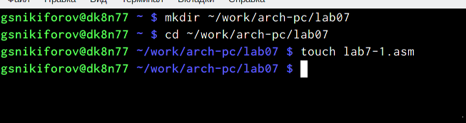

Листинг 7.1

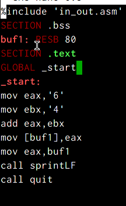

Создание исполняемого файла и его запуск(sprintLF)

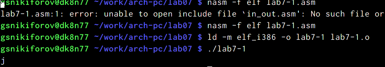

Создание исполняемого файла и его запуск(замена строк на числа)

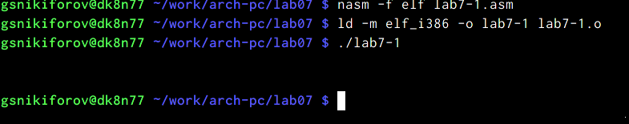

Листинг 7.2

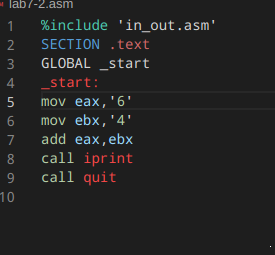

Создание исполняемого файла и его запуск(iprintLF)

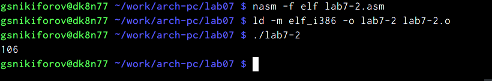

Создание исполняемого файла и его запуск(замена строк на числа)

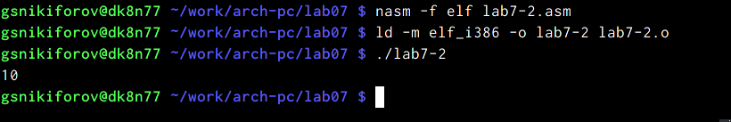

Создание исполняемого файла и его запуск(iprint)

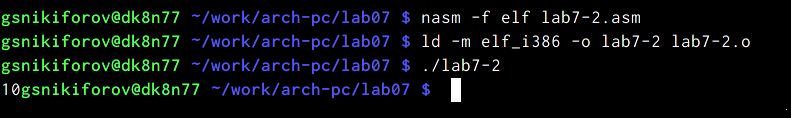

Создание программы с текстом из листинга 7.3 и ее запуск

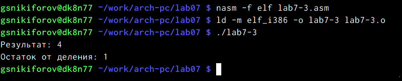

Создание исполняемого файла и проверка его работы для нового выражения

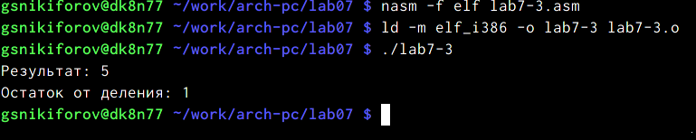

Создание программы с текстом из листинга 7.4 и ее запуск(вычисление варианта)

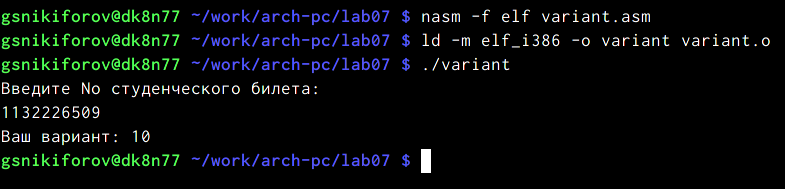

ОТВЕТЫ НА ВОПРОСЫ:

1- mov eax, masg call sprintLF

2- Для ввода переменной и сохранения введенных данных

3- Для преобразований кода переменной ASCII в число

4- mov ebx, 20 div ebx inc edx

5- В регистр ebx

6- Для увелечения значения edx на 1

7- mov eax, edx call iprintLF

Самостоятельная работа

Написание кода программы для решения 10ого варианта

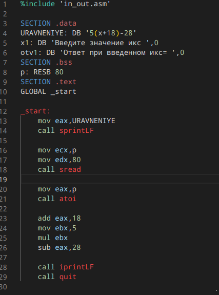

Вычисление уравнения с помощью кода программы

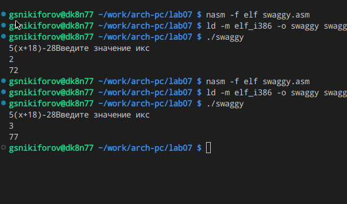

# Выводы

Освоил арифметические инструкции языка ассемблера NASM.

# Список литературы{.unnumbered}

::: {#refs}
:::
